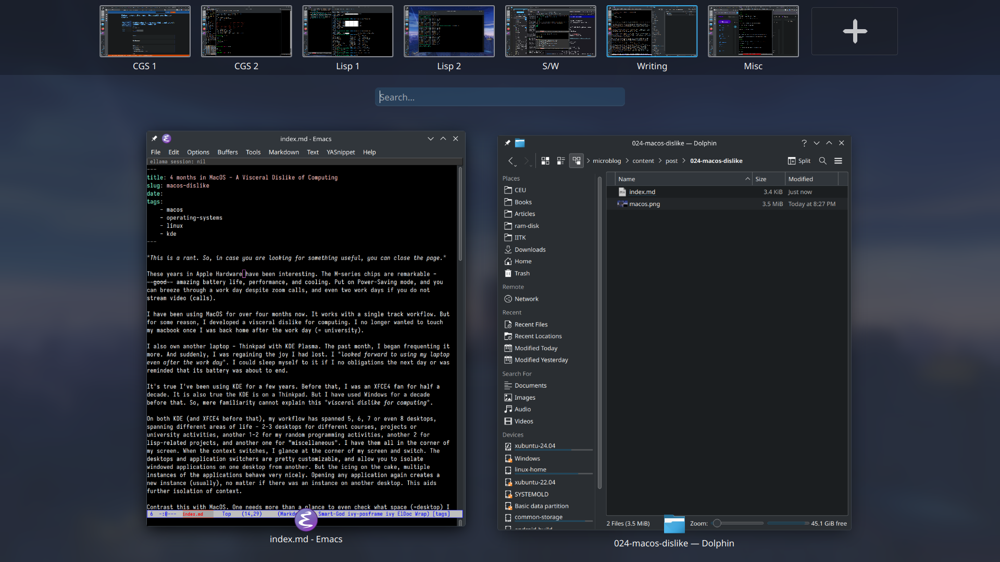
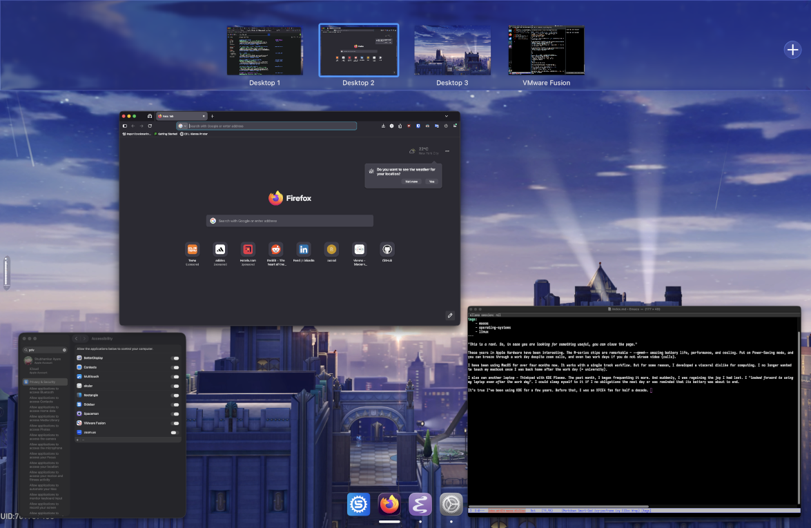

*This is a rant. So, in case you are looking for something useful, you can close the page.*

These years in Apple Hardware have been interesting. The M-series chips are remarkable - ~~good~~ amazing battery life, performance, and cooling. Put on Power-Saving mode, and you can breeze through a work day despite zoom calls, and even two work days if you do not stream video (calls).

I have been using MacOS for over four months now. It works with a single track workflow. But for some reason, I developed a visceral dislike for computing. I no longer wanted to touch my macbook once I was back home after the work day (= university).

I also own another laptop - Thinkpad with KDE Plasma. The past month, I began frequenting it more. And suddenly, I was regaining the joy I had lost. I *looked forward to using my laptop even after the work day*. I could sleep myself to it if I had no obligations the next day or was reminded that its battery was about to end.

It's true I've been using KDE for a few years. Before that, I was an XFCE4 fan for half a decade. It is also true the KDE is on a Thinkpad. But I have used Windows for a decade before that. So, mere familiarity cannot explain this *visceral dislike for computing* I experienced recently.

On both KDE (and XFCE4 before that), my workflow has spanned 5, 6, 7 or even 8 desktops, spanning different areas of life - 2-3 desktops for different courses, projects or university activities, another 1-2 for my random programming activities, another 2 for lisp-related projects, and another one for "miscellaneous". I have them all in the corner of my screen. When the context switches, I glance at the corner of my screen and switch. The desktops and application switchers are pretty customizable, and allow you to isolate windowed applications on one desktop from another. But the icing on the cake, multiple instances of applications behave very nicely. Opening any application again creates a new instance (usually), no matter if there was an instance on another desktop. This aids further isolation of context.

Contrast this with MacOS. One needs more than a glance to even check what space (=desktop) I am in and what other spaces I can switch to. It's a multi-finger swipe, and then one more to return back to the application I was working in. MacOS (and other dumbed-down operating systems including Android and iOS) hate multiple instances of apps. Opening an application again from another desktop will greet you with an invisible window, from which you can figure out if you are in the same app as before because the app did not open for some reason or the invisible window or, perhaps, the app is slightly heavy and still in the process of being opened. There are certainly ways to open multiple instances of the app. These rely on the terminal, rather than being the default or being integrated into the launcher.

Will I *ever* get over this visceral dislike for MacOS? Perhaps, when KDE comes to it. But if the single vs multi-instance apps is a source for my dislike, then nothing short of a MacOS restructuring perhaps.

Will more affordable Thinkpads *ever* get longer battery lives? I am more betting my hopes on this. Hopefully, in a few years, long-battery life T-series Thinkpads (or X-series, a human can dream :')) will become affordable that I will just grab an awesome deal some day :).

I myself am not sure what drives my dislike. But, at this point, I don't think the reason is "you just have to get used to it".
