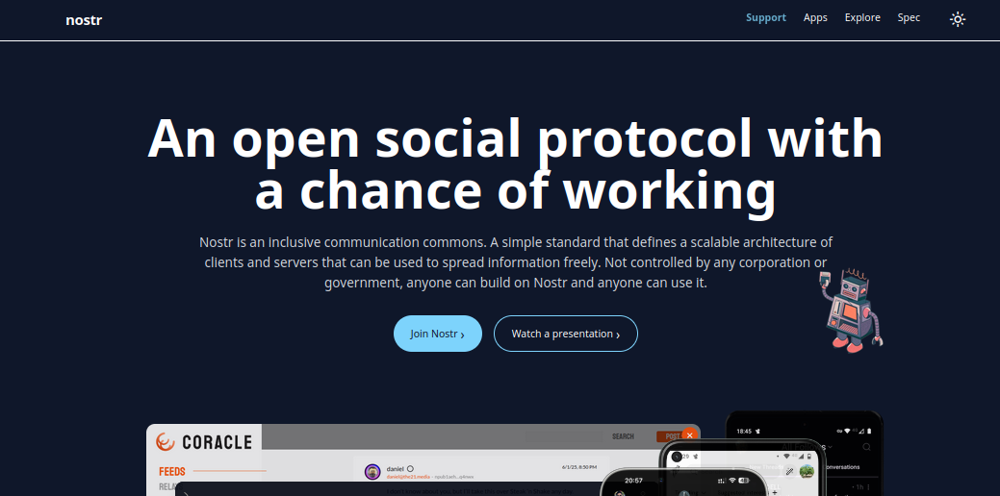

In 2005, Huffman and Ohanian got together and launched what they called the ["front page of the internet"](https://www.britannica.com/money/Reddit). Here, users could post the best articles from news outlets, journals, or even images and just text posts with each other, upvote what they liked and help others find good content. This platform was called [Reddit](https://www.reddit.com/). In 2026, [reddit is still the 8th most popular website on the entire internet](https://en.wikipedia.org/wiki/List_of_most-visited_websites) even more popular than WhatsApp(!)

Around the same time, in 2006, [Dorsey and others](https://en.wikipedia.org/wiki/History_of_Twitter) launched another platform that allowed people to share SMS-sized chunks of text with each other. This was Twitter, also known as [X](https://x.com) in recent times. In 2026, X is even more popular than Reddit!

Likewise, the other top websites include Google, YouTube, Facebook, Instagram, ChatGPT(!), WhatsApp, and TikTok. Each is owned by some or other private corporation.

The open source enthusiasts amongst us are not very happy with this state of the internet.

First, the public internet is supposed to be *public*. Anyone who has access to the internet, should be able to view the content they want to view without barriers. Platforms like X, Facebook, Instagram, WhatsApp, TikTok, and to a lesser extent also Reddit and YouTube forbid non-users from viewing the content. In other words, every time you visit one of these platforms, you need to have an account with them to view content. Ever been annoyed by the constant popups for log ins or location-based restrictions? Well, it doesn't have to be this way!

Secondly, if some content does not comply with the policies of platform moderators, it gets removed. [For X, this takes the form of centralized moderation by X sometimes following government orders and sometimes mistakes.](https://en.wikipedia.org/wiki/Censorship_by_X) On reddit, the story is slightly more complex. While Reddit as a whole has some policies, the actual moderation is performed by volunteer users -- known as moderators -- so long as the content still agrees with the top-level policies. Until 2023, reddit moderators had access to third party tools that made moderation relatively doable. These tools also provided various other accessibility services. However, [in 2023, Reddit introduced changes that made third party tools either non-free or impossible](https://en.wikipedia.org/wiki/Reddit_API_controversy). After Reddit did not budge to appeals, many users and moderators quit reddit. Though, before deleting, they also deleted their comments, accounts, and also made their subreddits inaccessible. If you came across "deleted" or "unintelligible" comments on reddit, this was the context under which this happened. I myself cannot stand the "official" [android] reddit app to this day, and limit myself to its webapp.

Were moderators just shitty humans for protesting and had no brains? Well, I'd perhaps be displeased at the content deletion, which has AI and content disattribution to blame too. But more importantly, reddit moderators are volunteers. They moderate out of their own time and passion, and without any monetary compensation. And [subreddit moderation can be tough and also require actual qualification!](https://arstechnica.com/gadgets/2023/07/reddit-calls-for-a-few-new-mods-after-axing-polarizing-some-of-its-best/) And yet, what reddit offered them in return was a ban of the moderation tools themselves!

What has open source to do with all this? Open source means you have access to the software and the source code that runs the software. If you don't want a certain change to happen, or if you want a certain change to happen, you are completely free to make that change. Though, indeed you still need your own computers, servers and devices to run the modified software! In other words, if reddit were open source, this mishap could have been avoided!

Well, not quite, there was still the possibility that moderators and admins of open source reddit of this counterfactual universe might still have went ahead with the API changes. What is needed then is the ability for multiple "reddit instances" to talk to each other, so that if you disagreed with the moderation policies and tools of one instance you could switch to another. Turns out this actually exists! People have been working on this -- [Fediverse](https://fediverse.party/en/fediverse/) -- since the 2010s. The idea is exactly that multiple "instances" or "versions" of reddits -- and even [instagrams, youtubes, Xs, mediums and goodreads](https://jointhefediverse.net/join?lang=en-us) -- can freely talk to each other. Users can sign up on one instance and use that same account on other instances. They can "subscribe" to as well as post content on other instances.

That sounds very good. *Sounds.*

.

.

.

In practice, there are [494 lemmy instances](https://join-lemmy.org/instances) alone. I won't even start to count Mastodon and others. Several problems arise:

1. It's *supposed to* not matter which lemmy instance you sign up for. However, it *actually matters*, because if the instance you sign up for goes down -- say, because the admins ran out of funds or there were some server issues, etc -- *your account* goes down with that instance!
2. Each lemmy instance has its own set of communities. So, c/programming on lemmy.world is a "different" community than c/programming on lemmy.ml. In principle, you can subscribe to both of them. In principle, different lemmy instances and communities can subscribe to each other. But are all the 494 lemmy instances going to do that for all the 493 other lemmy instances? That simply does not scale!

And there are all different kinds of bugs arising from database duplication and what not.

.

.

.

But, there is an alternative!

Enter the [Nostr](https://nostr.org/) protocol - which literally stands for *Notes and Other Stuff Transmitted by Relays* -- that was developed as recently as 2020.

The elements of Nostr map quite straightforwardly onto the real world. In the real world, our identities are owned by us. When we talk, a *medium* -- air or something else -- transmits our message to another user. In Nostr, similarly, the identities are owned by us. These identities can write messages that are transmitted to others via what are called relays. This is in contrast to Lemmy and Fediverse, where identities belong to the server-instance. Thus, it can appear quite strange when one views Nostr through the lens of existing social media. On the other hand, when one views Nostr through the lens of the real world, it seems very straightforward. This separation of Nostr identities from relays also means that when a relay goes down, even when *all relays* go down, that identity still remains with you!

Using concepts from cryptography, a Nostr identity takes the form of a public key called *npub* and a private key called *nsec*. Both of these are essentially long sequences of random characters. These keys are used by [Nostr clients](https://nostrapps.com/). As its name suggests, an *nsec* is something you should never share with other people or Nostr clients you don't trust!

Whenever you write a *note* using a Nostr client such as [Amethyst](https://amethyst.social/), this *nsec* is used to *sign* your note. Other users can then use their own Nostr clients to verify using your public key *npub* that, indeed, the note was actually written by you, and not someone else falsely claiming to be you.

Note that, in verifying that a note was actually written by you, no server or central system is necessary! Some kind of *relay* is still necessary for transmission. But it is a relatively dumb software that simply transmits notes from some clients to other clients. This is as good as *air*. Air does nothing. It just transmits my voice to you!

A relay can still filter out notes. However, it is ultimately the client who decides which other users' notes to actually show you. Most clients do this in two ways. Firstly, you can "follow" other users npubs. By doing this, you should get the notes they write or reshare in *your feed*. Secondly, you can browse content from some relays and also filter them out on the basis of various criterion. For example, if you dig a bit into Nostr, you might notice that it is surrounded by bitcoin and cryptocurrency ~~enthusiasts~~ freaks. I usually have a preference for content other than bitcoin. So, I have set "bitcoin" as a filter term in my client. This means I don't see anything mentioning bitcoin in the first place!

You can probably start out with [nostr.org](https://nostr.org/) or [nostr.how](https://nostr.how/en/what-is-nostr) and then explore the internet to learn more. The "Join Nostr" on nostr.org should already get you a pair of npub and nsec that you can use for posting.

</img>

More importantly, for merely reading, you don't need any keys or install any software at all! You can just use a [Nostr webclient](https://nostrapps.com/#microblogging#web) -- [Primal](https://primal.net/reads) is usually a recommended choice. [Amethyst](https://amethyst.social/) is a reasonable android app.

If you decide to give Nostr a try, do follow me! [digikar](https://primal.nprofile1qqs2540j8qjkjpelcun94e0j8jg7lsgwztvsxvsp9dd4hydq72v4gzclzxztk)

[HackerNews 250](https://primal.net/p/nprofile1qqspyca37sznlgx4jvdqrnn2nj5uj5mxmxa6me5elxgmtgmwd9g4atckj0nmw) is another interesting poster to follow!

All that said, I wouldn't say Nostr is as smooth as Instagram 👀. So, expect some friction. More importantly, there is the [Network effect](https://en.wikipedia.org/wiki/Network_effect) which means Nostr won't provide much value until there are enough users in one's own circle using it. It is probably a decade too early to advocate Nostr.

I myself am passively looking for bot tools to automate content posting to Nostr from other platforms. But I currently have my hands on a bit too many things, so I'll relegate that, perhaps, to 2027 or later.
