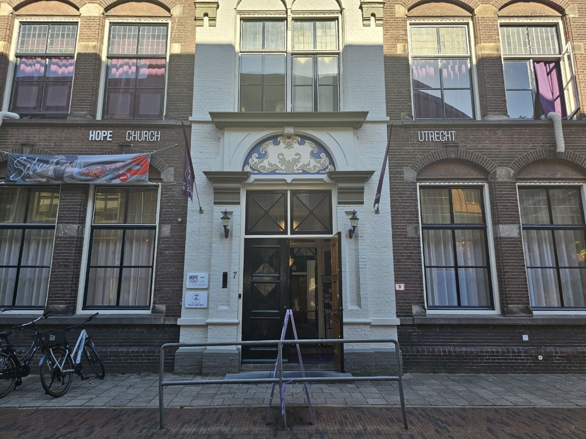
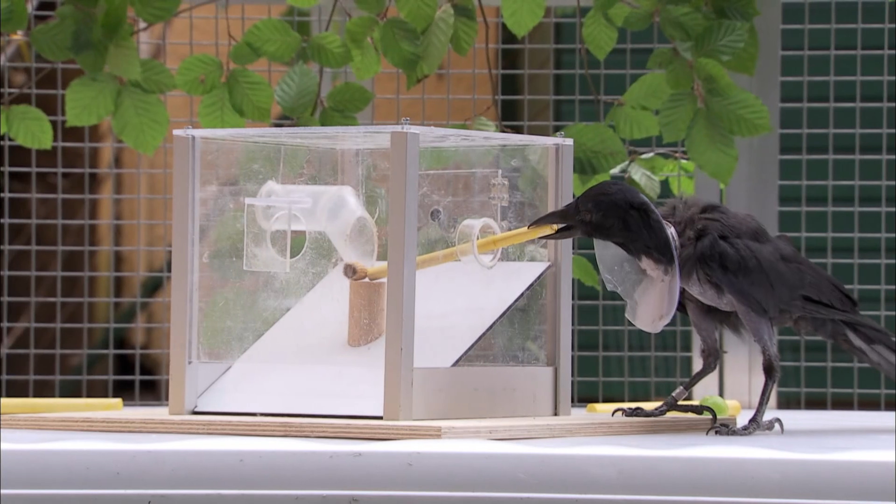
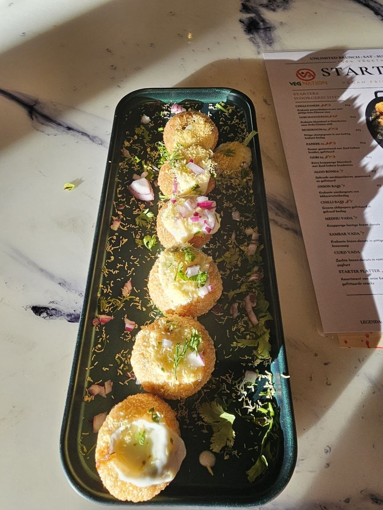

The past week I had the opportunity to attend the [ESPP Conference 2026](https://espp2026.sites.uu.nl/). This one is by European Society for Philosophy and Psychology.

As someone who has half-jokingly been called a philosopher on different occasions, it was a very neat experience. And while I hate philosophizing without a practical purpose (ironic, isn't it? such is my life), the conference was great. I enjoy philosophy being used to guide practical action and, since I'm a cognitive-science researcher in-training, I also enjoy philosophy being used to guide research in psychology and cognition. The conference was a mix of sparsity and density. The mornings were light, the afternoons packed, but still plenty of time for lunch in the middle. The timetable and abstracts are available from [this page](https://espp2026.sites.uu.nl/programme-draft/).

The conference itself was held in Boothstraat Church in Utrecht.

</img>

As a memoir, and perhaps, as a future note, here are some of my personal highlights:

## Day 1 - Tuesday

1. The section on [Compositionality](https://espp2026.sites.uu.nl/programme-draft/#tuesday) reminded me of Greenberg (2023). This is a paper on the iconic-symbolic spectrum in representations. This was first brought to my (our) notice during Susan Carey's visit to CEU in January. The topic of representations has, however, been on my mind almost since the time I started cognitive science during my masters, and was made more interesting by chapter 3 of Pylyshyn (2007) on conceptual vs nonconceptual representations.

    - Greenberg, G. (2023). The Iconic-Symbolic Spectrum. Philosophical Review, 132(4), 579–627. https://doi.org/10.1215/00318108-10697558

    - Pylyshyn, Z. W. (2007). Things and Places: How the Mind Connects with the World. MIT Press.

2. Further sessions on the topic of non-linguistic thought were good and informative, albeit like much research at most places and fields, not satisfying. Even though we have evidence (what exactly?) that human thought is very unlike proposition or first order logic, people still remain obsessed with it. There are a number of non-classical logics developed over the past century (Priest, 2008; Wang, 2013), these sadly remain obscure.

    - Priest, G. (2008). An introduction to non-classical logic: From if to is. Cambridge university press.

    - Wang, P. (2013). Non-axiomatic logic: A model of intelligent reasoning. World Scientific.

3. Another complaint I have had with psychological research on compositionality and combinatoriality is that it seems very ill-defined. Is composing of functions like add and multiply the same as composing a red color with square shape? Perhaps, someone somewhere has tried to work out the ontology of compositionality, but it hasn't yet penetrated mainstream research on the topic.

4. As someone interested in programming language design (see [moonli](https://moonli-lang.github.io/) and [peltadot](https://gitlab.com/digikar/peltadot)), and also language of thought, I also felt a jolt of inspiration to use Gardenfors' Conceptual Spaces to design a language of thought. If feasible, it should resolve both the issues I have with the vagueness of various philosophical and psychological terms, as well as some issues I have with Conceptual Spaces. Though, it still remains uncertain when exactly I'd undertake this venture.

5. [Quilty-Dunn](https://scholar.google.com/citations?user=1b0IXFkAAAAJ&hl=en&oi=sra) and [Eliasmith](https://scholar.google.com/citations?user=KOBO-6QAAAAJ&hl=en) were names I had heard before. The conference has again been a nice reminder for me to visit their works.

6. In the context of Quinian Bootstrapping, again, it seemed an actual programming language of thought could resolve some of the issues that came up.

7. I had explored Woodward (2016) before regarding the problem of (causal) variable choice. While the problems that I'm concerned with for my doctoral thesis concern variable choice at a personal level, some talks (particularly, [Pommer](https://espp2026.sites.uu.nl/wp-content/uploads/sites/1232/2026/06/ESPP2026_File_277.pdf)) were a nice reminder that Woodward's work is primarily concerned with variable choice for scientists. I also need to checkout Woodward (2008).

    - Woodward, J. (2008). Mental Causation and Neural Mechanisms. In J. Hohwy & J. Kallestrup (Eds.), Being Reduced: New Essays on Reduction, Explanation, and Causation (pp. 218–262). Oxford University Press.

    - Woodward, J. (2008). Invariance, modularity, and all that: Cartwright on causation. In Nancy Cartwright’s philosophy of science (pp. 210–249). Routledge.

    - Woodward, J. (2016). The problem of variable choice. Synthese, 193(4), 1047–1072. https://doi.org/10.1007/s11229-015-0810-5

8. Further, as someone also interested in the nature of scientific explanations, [Kaplan](https://scholar.google.com/citations?user=r1qDidUAAAAJ&hl=en&oi=sra) and [Craver](https://scholar.google.com/citations?user=cTBDU3AAAAAJ&hl=en&oi=sra) were names I probably hadn't heard of before, but whose work seems very very interesting.

9. As someone also currently interested in the relation between intuitive physics and visual cognition at large, [Balaban](https://scholar.google.com/citations?user=n1a607kAAAAJ&hl=en&oi=sra)'s work also seems very very interesting. In case you like big names, Balaban also has some recent work with Ullman.

10. I have also been interested in Amartya Sen's Development as Freedom (2000). The basic idea is that development should not just mean an increase in GDP (combined, per-capita, or media), but it should be a multidimensional target that revolves around different kinds of freedom. Interestingly, I learnt from [Karki](https://espp2026.sites.uu.nl/wp-content/uploads/sites/1232/2026/06/ESPP2026_File_99.pdf) that the same notion of freedom that led to Amartya Sen's work has also led to the notion of education as freedom or autonomy-enhancing enterprise (my paraphrase). In today's context of constantly progressing AI that risks deskilling, the idea then is that at least those skills should be preserved which are freedom-enhancing for the student. This looks like a potentially nice attitude to decide which tasks one should allow students to handover to the AI, and which tasks and skills they should prioritize learning. Finally, something that might seem obvious in hindsight, but wasn't easy to see before I attended [Koi](https://espp2026.sites.uu.nl/wp-content/uploads/sites/1232/2026/06/ESPP2026_File_190.pdf)'s talk was that (my extension perhaps) freedom implies the individual having a particular decision set. A decision set refers (and this is where Koi comes in) not to options that an external observer can see, but to options that the individual herself can see. In evaluating freedom, it matters whether the policy evaluator thinks "some people can go to university" in contrast to whether *you* can think "*I* can go to the university".

    - Sen, A. (2001). Development as freedom. Oxford University Press Academic UK.

## Day 2 - Wednesday

Since Day 1 was so exciting, I wasn't exactly in a receptive state on Day 2. Nonetheless -

1. There was [an interesting talk](https://espp2026.sites.uu.nl/wp-content/uploads/sites/1232/2026/06/Keynote-maazvita.pdf) that since consciousness perhaps depends on the substrate and autopoesis, machines cannot be conscious. (Although, artificial life can be conscious if it were autopoetic.) This isn't exactly a new point, and probably dates back to Lycan (1995) and even before. If there was more subtlety to the point, I was unable to grasp it.

    - Lycan, W. G. (1995). Consciousness. MIT Press.

2. This was followed by [a symposium](https://espp2026.sites.uu.nl/wp-content/uploads/sites/1232/2026/06/Symposium-bases-of-cognition.pdf) that covered different topics including explanatory pluralism. These again referred to Woodward as well as Craver and Kaplan, and a number of other authors I probably hadn't heard before. Since we were discussing explanations themselves, there was also a reference to a Theory of Explanation (I'm sure there are several of them).

    - Behrens, S., Krämer, S., & Roski, S. (2024). Introduction: difference-making and explanatory relevance. Philosophical Studies, 181(9), 2047–2061. https://doi.org/10.1007/s11098-024-02213-8

    For my own self, two further points I felt relevant included:

    - "Explanations are hyperintensional relations." The exact meaning is lost on me, but I've been dipping my toes into hyperintensionality in causal judgments this past year, so this ringed a bell.
    - The explanations I seek about cognition are computational simulations of mechanistic models rather than computational models themselves.

3. Going to the afternoon sessions, I found some more interesting points for my broader interests: (i) The same brain region is involved in multiple activities. See Poldrack (2006) and Anderson (2010) for neural reuse. As someone who's been part of cognitive science departments (both, my old at IITK and current at CEU) that have professors that are skeptical of neuroimaging claims, these look like interesting papers. (ii) That there is something to be said about the numerous (78+) neuron kinds in the brain -- see Anderson & Pessoa (2011).

    - Poldrack, R. (2006). Can cognitive processes be inferred from neuroimaging data? Trends in Cognitive Sciences, 10(2), 59–63. https://doi.org/10.1016/j.tics.2005.12.004

    - Anderson, M. L., & Penner‐Wilger, M. (2012). Neural reuse in the evolution and development of the brain: Evidence for developmental homology? Developmental Psychobiology, 55(1), 42–51. https://doi.org/10.1002/dev.21055

    - Anderson, M., & Pessoa, L. (2011). Quantifying the diversity of neural activations in individual brain regions. Proceedings of the Annual Meeting of the Cognitive Science Society, 33(33).

4. Pylyshyn (1986, 2007) had mentioned that representations are only useful explanatory tools when non-representations cease to be helpful. But these are relatively short remarks on the topic that are seldom discussed in cognition. Through [Garbayo](https://espp2026.sites.uu.nl/wp-content/uploads/sites/1232/2026/06/ESPP2026_File_53.pdf)'s talk, I also learnt about Clark & Toribio (1994) that points out two conditions for representations to be explanatory useful, as well as Saigusa (2008).

    - Clark, A., & Toribio, J. (1994). Doing without representing? Synthese, 101(3), 401–431. https://doi.org/10.1007/bf01063896
    - Pylyshyn, Z. W. (1986). Computation and Cognition: Toward a Foundation for Cognitive Science. The MIT Press. https://doi.org/10.7551/mitpress/2004.001.0001
    - Saigusa, T., Tero, A., Nakagaki, T., & Kuramoto, Y. (2008). Amoebae Anticipate Periodic Events. Physical Review Letters, 100(1). https://doi.org/10.1103/physrevlett.100.018101

    Finally, there was also reference to [Godfrey Smith](https://petergodfreysmith.com/)'s work, who is another big name I had heard before but had forgotten about. Thanks for the reminder!

## Day 3 - Thursday

The afternoon of the third day I was met with a slight headache, and decided to take a precautionary break, since my own talk was still 24 hours away. The result was that I missed some very interesting sessions on consciousness :'). Can't catch 'em all I guess.

1. I've tried reading Sperber's work, but every time I drift off to something. (This happens with all voluntary things though; there are just too many interesting things!) This time, there was a reminder to Sperber & Wilson (1992), but also lots of other work -- 1986, 1997, 2019. The 2019 chapter is a concise review in particular.

    - Sperber, D., & Wilson, D. (1986). Relevance: Communication and Cognition (Vol. 142). Harvard University Press Cambridge, MA.
    - Wilson, D., & Sperber, D. (1992). On verbal irony. Lingua, 87(1), 53–76.
    - Sperber, D., & Wilson, D. (1997). Remarks on relevance theory and the social sciences.
    - Sperber, D. (2019). Personal Notes on a Shared Trajectory. In Relevance, Pragmatics and Interpretation (pp. 13–20). Cambridge University Press. https://doi.org/10.1017/9781108290593.002

2. Perhaps, most usefully, there is now a *diamond* open access journal for Experimental Pragmatics. Thanks to [Ira Noveck](https://sites.google.com/site/iranoveck/home) for sharing.

    See https://journals.uclpress.co.uk/jxprag/

## Day 4 - Friday

1. That humans don't just learn from each other, but also teach (and shape) is each other seems obvious to a non-psychologist. Yet psychology research on this topic is relatively non-mainstream outside education. Thus, the fourth day was particularly interesting for bringing this topic to the forefront. See the [program](https://espp2026.sites.uu.nl/programme-draft/#friday) for more details!

2. Being situated in a Cognitive Science department that also focuses on theory of mind and social cognition, I also come across Apperly & Butterfill's work from time to time. Apperly, Devine & Butterfill (2026) is another addition.

    - Apperly, I. A., Devine, R. T., & Butterfill, S. A. (2026). Mindreading as asynchronous coordination: The MAC account of theory of mind performance, and individual differences. Cognition, 274, 106569. https://doi.org/10.1016/j.cognition.2026.106569

3. As a supporter of neurodiversity, I remain puzzled by a paradox that I was quite pleased was elucidated in [Castro](https://espp2026.sites.uu.nl/wp-content/uploads/sites/1232/2026/06/Symposium-mindshaping.pdf)'s talk. Or at least they attempted an elucidation that I failed to grasp, and did not quite find the opportunity to clarify. But I revisited the [presentation](https://zenodo.org/records/21142229) now and I still fail to grasp it.

    So, perhaps, I'll describe my own view on the paradox. The paradox is roughly as follows (i) Neurodiversity implies there is no single "right" mind, and that neurodiverse minds are just as right as neurotypical minds. The inconveniences and difficulties that neurodiverse individuals face are because neurotypicals dominate the world. These difficulties are in the similar spirit as those that men would face in the lack of urinals and women would face in the lack of standard toilets. (ii) If all neurodiversity is to be explained by diversity of minds, there should be no need for medications or, perhaps, even diagnosis.

    And while I agree with the suggestion by Castro (if I understood correctly) that there is a social-normative aspect to what is dubbed as a disorder, I think it is useful that a neurodiverse child (or adult) be provided with sufficient resources so that they do not fall behind their peers for reasons beyond their control. The notion of falling behind can itself be defined in terms of the freedom and capability-development that was mentioned on day 1 of the conference. Finally, the notion of sitting in an office environment being hyperfocused on some or the other task seems so different to the natural wild environment that humans (or life in general) evolved in for the past million years (or hundred million).

4. In the last session, [I had my own talk](https://espp2026.sites.uu.nl/wp-content/uploads/sites/1232/2026/06/ESPP2026_File_240.pdf). Unfortunately, the attendance was quite low. I also felt a bit out of place given that my talk and work was a weird mix of formal philosophy, computational modeling, and psychology. In particular, it was about [a non-counterfactual account of actual causation](https://www.tandfonline.com/doi/full/10.1080/24740500.2025.2477315), and particularly, the presence or absence of hyperintensional effects therein. Put in simpler words, it concerned whether (graded) causal judgments differ even if the logical structure of events (in terms of their truth-tables) differ. Such [hyperintensional effects are known about actual causation](https://academic.oup.com/book/7543/chapter-abstract/152512742). And while I have enjoyed this, apparantly, there weren't many people at ESPP into actual causation. Nonetheless, Sarah Beck suggested the role of temporal proximity for causal judgments. This is actually a fairly researched topic I hadn't looked into before, so it'd be exciting to see if I delve deeper into it.

5. The very last talk was by [Sarah Beck](https://espp2026.sites.uu.nl/wp-content/uploads/sites/1232/2026/06/ESPP2026_File_156.pdf) and was perhaps the most fun talk of the conference given a demonstration similar to this :):

    Source: [reddit](https://www.reddit.com/r/KidsAreFuckingStupid/comments/p1erbz/my_son_was_upset_that_he_couldnt_fit_into_the/)

    

    The explanation is that kids learn the *functions* (to sit inside) of *artefacts* (such as car). And the scale is then irrelevant until the child is of a certain age.

    The talk itself concerned if children search for multiple solutions to physical problems. It was based on similar prior research in animal cognition:

    <a href="https://www.pbs.org/video/these-birds-will-solve-puzzles-for-snacks-yga9ke/" target="_blank"></img></a>

Perhaps, the best part of attending the conference was I got to enjoy some very good dahi puri, it's been a rarity outside Pune.

</img>

I guess I'll leave you at that! Have a nice day, or night :).
