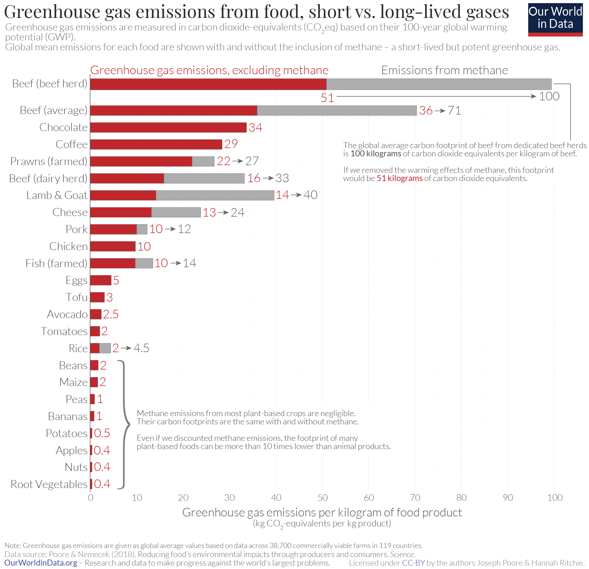
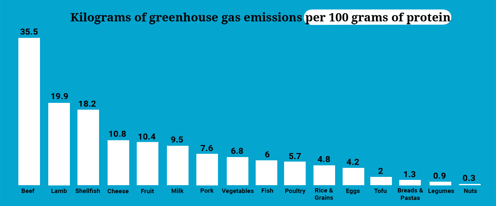

Years ago, I used to try motivating people to pollute less. Later, I learnt that [90% of individuals contributed overall one-third to climate change since the 1990s](https://iiasa.ac.at/news/may-2025/worlds-wealthiest-10-caused-two-thirds-of-global-warming-since-1990). Even [the notion of a personal carbon footprint was popularized by a fossil fuel company as a point of distraction](https://www.theguardian.com/commentisfree/2021/aug/23/big-oil-coined-carbon-footprints-to-blame-us-for-their-greed-keep-them-on-the-hook). And it has worked remarkably well! Many of us try to reduce our individual carbon footprint by switching off lights when unused, opting walking or cycling, and going vegan. But does that make a difference?

The notion that each of us take can individual actions to mitigate the climate crisis is very comforting psychologically. And if vegan or plant-based diet is another such psychologically comforting thing, that is okay. However, for me to be psychologically comfortable, I need individual goodwill to be aligned with collective benefits. Thus, for my own sake, I undertake the below exploration to find the cost of diet, how much of an environmental impact it has, and how much of the climate crisis can be mitigated by diet change alone.

Before beginning, please note that estimating each of these numbers can be a painfully effortful process that can span entire PhDs or research careers. Thus, these are subject to errors. If you know more, feel free to chime in.

## Greenhouse gas emissions from agriculture

Let's start with [greenhouse gas emissions from agriculture](https://en.wikipedia.org/wiki/Greenhouse_gas_emissions_from_agriculture):

> Greenhouse gas emissions from agriculture are large: the agriculture, forestry and land use sectors contribute between 13% and 21% of global greenhouse gas emissions. Direct greenhouse gas emissions include those from rice and livestock farming. Indirect emissions from the conversion of non-agricultural land such as forests into agricultural land are also very important. With regard to direct emissions, nitrous oxide and methane makeup over half of total greenhouse gas emissions from agriculture.
>
> ...
>
> Furthermore, there is also fossil fuel consumption for transport and fertilizer production. For example, the manufacture and use of nitrogen fertilizer contributes around 5% of all global greenhouse gas emissions.

What?! What has rice to do with greenhouse gas emissions?!

It turns out that the paddy fields used for growing rice harbour anaerobic bacteria which release methane. Globally, rice fields produce about 1.1 billion tons (GT) of CO2-equivalent emissions. By contrast, the [total CO2-equivalent emissions are in the ballpark of 53.2 GT](https://edgar.jrc.ec.europa.eu/report_2025).

[Fertilizers account for about 2.6GT.](https://www.sciencedaily.com/releases/2023/02/230209114736.htm) Interesting, only one-third of the emissions are from the production processes, and two-thirds are from after application in the field. In contrast, [the CO2-equivalent emissions from aviation are about 0.9GT or 1.8GT depending on what you account for](https://ourworldindata.org/global-aviation-emissions). For shipping, [this is about 1.1GT](https://climate.ec.europa.eu/areas-action/transport-decarbonisation/reducing-emissions-shipping-sector_en).

There are two other concerns: (i) Given that there is emission-inequality amongst people, is there diet-related emission-inequality amongst people too? (ii) What part of these emissions are avoidable? Clearly, growing food is not something we can do away with.

But before going there, let's take a look at what is usually taken to have a significant impact.

> Livestock farming is a major source of greenhouse gas emissions.
>
> Farm animals' digestive systems can be put into two categories: monogastric and ruminant. Ruminant cattle for beef and dairy rank high in greenhouse gas emissions. In comparison, monogastric, or pigs and poultry-related foods, are lower. The consumption of the monogastric types may yield less emissions. Monogastric animals have a higher feed-conversion efficiency and also do not produce as much methane. Non-ruminant livestock, such as poultry, emit much less greenhouse gas.

[Livestock accounts for about 6 to 8 GT of CO2-equivalent emissions.](https://thebreakthrough.org/issues/food-agriculture-environment/livestock-dont-contribute-14-5-of-global-greenhouse-gas-emissions) However, [pork and chicken are about 5 and 10 times as efficient as beef or lamb](https://www.bbc.com/future/article/20221214-what-is-the-lowest-carbon-protein). In fact, the carbon emissions from cheese are even higher than chicken or pork.

> Total emissions from agrifood systems in 2022 amounted to 16.2 billion tonnes of carbon dioxide equivalent (Gt CO2eq) of GHG released into the atmosphere [...]
>
> In 2020, it was estimated that the food system as a whole contributed 37% of total greenhouse gas emissions [...]

So, well, food does have a very significant impact on the environment.

## Is there inequality in food emissions?

In the US, [about 20% of the diets accounted for 46% of the diet-related greenhouse gas emissions (see figures 1 and 2)](https://iopscience.iop.org/article/10.1088/1748-9326/aab0ac). The average emissions of the top 20% (>10 kg CO2 / person / day) were more than twice that of the average diet (5kg CO2 / person / day). (Thankfully, [these emissions are decreasing](https://grow.cals.wisc.edu/priority-themes/food-systems-priority-theme/americans-put-carbon-on-a-diet).)

[In Netherlands, this figure is about 3.5-5 kg CO2 / person / day.](https://pmc.ncbi.nlm.nih.gov/articles/PMC10271514/) [In China and Japan, this is about 2.9 and 3.8 kg CO2 / person / day.](https://hotorcool.org/news/comparing-nutrition-carbon-footprints-of-different-countries/). If you start digging, note the heterogeneity of metrics in terms of per day, per meal, or per year. India stands at 1.4 kg CO2 / person / day; however, this average figures hides both inequality and malnutrition.

So, well, yes, there is emission inequality when it comes to food. However, almost all of it can be reduced to beef, seconded by prawns, lamb, goat, and finally pork and chicken. Indeed the estimates are also going to depend on a whole host of factors as [this article summarizes](https://ourworldindata.org/carbon-footprint-food-methane).

What about the ultrarich? I haven't been able to find any data. Even after asking Claude, the only answer was that dietary impacts should not scale beyond a certain wealth, since there is only so much food a person can eat.

## How much of this can be avoided?

Yes, rice has carbon emissions, but these are more than 20 times as less as beef.

Then again, the two are not nutritionally equivalent. While maintaining a nutritional balance, the improvement is more modest ranging from [33% to 72%](https://www.carbonbrief.org/adopting-low-cost-healthy-diets-could-cut-food-emissions-by-one-third). Or also [46% by another estimate](https://www.frontiersin.org/news/2025/11/11/frontiers-nutrition-plant-based-diets-reduction-carbon-emissions-land-use).

> The researchers find that a healthy diet comprising the most-consumed foods within each country – such as beef, chicken, pork, milk, rice and tomatoes – emits an average of 2.44 kilograms of CO2-equivalent (kgCO2e) and costs $9.96 (£7.24) in 2021 prices, per person and per day.
>
> However, they find that a healthy diet with the least-expensive locally available foods in each country – such as bananas, carrots, small fish, eggs, lentils, chicken and cassava – emits 1.65kgCO2e and costs $3.68 (£2.68). That is approximately one-third of the emissions and one-third of the cost of the most-consumed products diet.
>
> In comparison, a healthy diet with the lowest-emissions products – such as oats, tuna, sardines and apples – would emit just 0.67kgCO2e, but would cost nearly double the least-expensive diet, at $6.95 (£5.05).

But, as we saw in the previous section, almost all of this stems from the high-emission meat eaters moving to low-emission meat and other foods. [US can thereby cut its food emissions in half.](https://biologicaldiversity.org/w/news/press-releases/study-cutting-us-meat-intake-half-could-prevent-16-billion-tons-climate-pollution-2020-04-30/)

## Summary

Food accounts for about 30-40% of global greenhouse gas emissions across all sectors. This can effortlessly be cut in half by the choices we make.

- If you can go vegan, try it.
- If you are like me and cannot stop yourself from eating meat, opt for eggs, chicken and pork. Beef and lamb produce 5-10 times as much emissions as eggs, chicken and pork. Additionally, prefer yoghurt to cheese. The impact of yoghurt is about 20 times less than cheese.

<!-- I have a pending argument from a friend that when one accounts for amino acids and essential micronutrients, the environmental impact of beef actually turns out to be lesser than the best vegan sources. However, I have not dug into this. -->
